---
title: Tableau Dashboard Design
---

Author: Hendrik A. Dreyer
=========================

Date: 20 June 2018
==================

Abstract
--------

*Tableau is widely used to build effective visualization, which are based on
large datasets and in the process assist users in finding deeper insight in the
associated data. This report explains how a given dataset is manipulated,
augmented and consumed by Tableau. Five questions, as anticipated in a top
management meeting scenario, are asked about the dataset. To answer the five
questions a rationale is given for the design decisions that underly four
visualizations. The four visualizations are used to build a final dashboard,
which is presented to the stakeholders of the scenario. Overarching tasks are
utilized that assists the presenter to effectively interact with the dashboard
to convey a storyline to the stakeholders regarding the data.*

Introduction
------------

This report describes the creation of a visualization dashboard as planned out
in . The dashboard consists of four primary visualizations, which provide
answers to five individual questions. The five questions shape the underlying
narrative of a scenario that takes place in a company’s weekly upper managerial
meeting. Such a meeting is attended by various stakeholders that are most likely
to generate the five questions in hand. The scenario is underpinned by four
individual tasks which overlays and binds the four individual visualizations
together.

This report begins by describing the data that drives the four visualizations in
the dashboard as well as additional data sourced from Wikipedia that augments
the original dataset. The Methods section provides a detail description of the
approach that was followed in designing the four visualizations. Each of the
five questions is addressed separately along side the design choices that went
into realizing each of the four visualizations.

The final dashboard is then overviewed in the Results and Discussion section
where the dashboard’s instructiveness and overlaid information is discussed.

Finally, a conclusion is drawn which casts light on a hidden aspect discovered
about the underlying dataset and why the dashboard succeeded in finding this
aspect.

Data
----

The four visualizations are based on the data as received in . The data file
holds order information for a store that sells goods. The data file contains
four datasets; Orders, Returns, Users and Regions. The data in the Return
dataset has been omitted because, the correlation between Orders and Returns has
proven to be insufficient. The Region dataset is empty and has therefore also
been omitted. Initial data exploration and evaluation proved to be frustrating
in terms of depth of complexity and therefore, it was opted to include
population numbers of each state, as specified in the 2010 USA census , to the
data set. To amalgamate the three contributing datasets a left-outer-join
between the Orders, Users and USA census data was executed in Tableau. This
produced the final data set on which the dashboard was built.

The final dataset resulted in 39 fields (including newly derived/calculated
fields);

16 categorical (nominal), 7 categorical (ordinal) and 16 quantitative fields.

Appendix A lists the layout of the left-outer-join structure as well as a table,
which lists a partial view of the fields in the final dataset. The derived and
calculated data fields in the data set will be listed and described as part of
each of the four individual visualizations as described in the Methods section.

Methods
-------

Careful consideration was taken when decided which encoding methods should be
used to most effectively and accurately convey insight into the underlying data
set. This was a very important exercise as it determined how effectively the
four visualizations could answer the five questions asked. This section lists
each of the five questions along with the visualization that was chosen to
answer that question. An analysis of each visualization is then presented along
with the chosen encoding methods that are utilized in the visualization.

### Question 1

**Stakeholder:** CEO of the company – “Please present me a geographical overview
of sales vs. profits, profit per capita and percentage profitability for the
past four years and break the map down in terms of the four geographical regions
the company covers and also report on population, customer and order numbers per
state?”

**Analysis**

The first question is really three questions in one. The question calls for
three different views over a geographical area – North America. To satisfy this
requirement in the question, Tableau’s worksheet overlay capability must be
exploited. This entails the creation of three different worksheet, which are
focused on the same geographical area but, which emphasize different statistics
regarding the underlying data set. In the main dashboard the user is equipped
with a dropdown menu through which each of the three views can be called into
focus (Figure 3). The three menu options are associated to the three worksheets
in the following way:

1.  Per Capita - Profit per Capita worksheet (Figure 4)

2.  Total Sales - Sales vs. Profits worksheet (Figure 5)

3.  Profitable – Percentage Profitability worksheet (Figure 6)

For all three the above listed visualizations the following visual encoding
rules were utilized:

1.  Identity Channels: Longitude, Latitude, Spatial region

2.  Magnitude Channels: Area (2D), Color saturation (divergent). The contrast of
    the black circles and the red-green divergent color saturation scale works
    well together in the sense that the two magnitude channels do not clash.

3.  Markers: Text, Tooltip (Breakdown of transportation cost per product
    category, Population total per state, Orders per state, Customers per state,
    URL link to the selected state’s wiki page)

To satisfy the temporal and regional selection requirement in question 1, an
overlaying couple of filters were implemented:

1.  Timeframe filter – This filter enables the user to step through the
    timeframe 2012 – 2015. The user can also opt to select an amalgamated total
    view of statistics for all the years combined.

2.  Region filter – This filter enables the user to view the statistics of each
    of the four regions separately or all together.

**Per Capita worksheet** - This worksheet illustrates the two per capita
statistics of each state. The black circle on each state illustrates the
sales per capita quantity and the color saturation illustrates the profit
per capita. These statistics are implemented by the following calculated
fields:

Sales per Population = ∑ (Sales) / ∑ (Population LOD) and

Profit per Population = ∑ (Profit) / ∑ (Population LOD)

For Tableau to summate population numbers per state, the LOD (Level of
Detail) functionality of Tableau must be utilized . By hovering the mouse
pointer over each state an additional statistic is displayed – number of
customers and the population (Figure 7). This satisfies the “population and
customer numbers” portion of question 1.

**Total Sales worksheet -** This worksheet describes the total sales and
total profits per state. The black circle on each state illustrates the
total sales and the color saturation of each state illustrates the total
profit. These statistics are the verbatim numbers as reported in the main
data set. By hovering the mouse pointer over each state an additional
statistic is display – shipping cost as broken down per product category
(Figure 8). This exploration is key in verifying an underlying issue
discovered in the dataset.

**Percentage profitability worksheet -** This worksheet reports the profit
of each state as a percentage of the total sales for each state. This
statistic is implemented by the following calculated field:

% Profitability = [∑ (Profit) / ∑ (Sales)] x 100

By hovering the mouse pointer over a state, an additional statistic is
displayed for the state – number of orders (Figure 9). This satisfies the
“number of orders” portion of question 1.

By combining three worksheets in an overlaid fashion the initial canvas
portion allocated to the dashboard can by tripled. If the user selects any
of the states on the map, the dashboard isolates the selected state by
highlighting it, dimming the rest of the map, displaying a tooltip
associated with the selected state and presents a url link at the bottom of
the tooltip. This url link is a link to the selected state’s wiki page. This
might come in helpful if management needs broader general information
regarding a state that is being discussed.

### Question 2

**Stakeholder:** Regional Managers – “We’d like to find out who our top
customers are for each region and each state?”

**Analysis**

As this question requests a ranking order, it was deemed appropriate to choose a
horizontal bar chart to express this order (Figure 11). By ranking the customers
in a descending order by total sales, it utilizes the attentive characteristics
of the chart and assist the users to quickly and easily identify the top
customers. A text marker is placed next to each horizontal bar so that the user
can see the precise figure associated with the ranked customer. Three additional
text markings are displayed with each of the horizontal bars - Rank, Customer
Name and Region. The user can specify the number of customers to be viewed by
typing a number into the *Top N Customer – Sales* entry box, which is situated
at the top left-hand corner of this worksheet. The entry dialog box was
implemented by a Tableau parameter – Integer with range 1 to N, a True/False
filter and a calculated field that calls the RANK Tableau function for all Sales
in the following manner: RANK(∑ ([Sales]))

By combining the number of customers specified in the *Top N Customer – Sales*
entry box and the region filter, the user can easily and quickly view the top
customers per region or in general. The following encoding rules were utilized
for this visualization:

1.  Identity Channels: Y-Axis Labelled, Text

2.  Magnitude Channels: Position on common scale

3.  Markers: Text

Finally, a line is displayed vertically across the horizontal bars. This line
pre-attentively indicates the average total sales of the selected N customers
and it establishes an intuitive relation among the selected N customers.

### Question 3

**Stakeholder:** Company Accountant – “I’d like to see a profit and loss
breakdown over product sub-categories as well as the total sales for each of the
product subcategories?”

**Analysis**

Profits and losses, by nature, ranges from negative to positive, i.e. a “loss”
is a negative number and a “profit” is a positive number. For that reason, an
ordered butterfly bar chart was chosen (Figure 13). The visualization orders the
product sub-categories from most profitable to least profitable. The horizontal
nature of the chart also enables the categories listed down the Y-Axis to be
easily readable. The following encoding rules were utilized for this
visualization:

1.  Identity Channels: Y-Axis – Spatial region, Text

2.  Magnitude Channels: X-Axis – Position on common scale, Color saturation
    (divergent)

3.  Markers: Text, Tooltip

A very strong cohesion is encoded onto the magnitude channel by super imposing
color saturation onto the position of the common scale and then additionally
augmenting it by the percentage profit text marks on each bar.

By hovering the mouse pointer over each bar, a tooltip is displayed that reports
and additional statistic – total sales for the associated product sub-category
(Figure 12). This satisfies the latter part of question 3.

### Question 4

**Stakeholder:** Marketing Manager –” I’d like you to query the dataset and
display a breakdown of customer segment spending over the main three product
categories for each region and express the ratios as part of the whole. Then,
for each of these segments I’d also like to know what the percentage
profitability is?”

**Analysis**

Seeing that there are only three product categories – Furniture, Office Supplies
and Technology, the pie chart surfaces as a likely candidate. Pie charts are, by
default, good at displaying 2 – 5 parts of a whole. But, the latter part of the
question warrants the pie chart unfavorable as the visualization also needs to
take customer segmentation into consideration. Therefore, it was opted to use a
stacked bar chart instead (Figure 14). However, to compare the percentage of
sales per customer segment over the three product categories, the stacked bar
chart visualization was expressed as a percentage of the whole, i.e. as parts of
100% of the total sales per segment. The following encoding rules were utilized
for this visualization:

1.  Identity Channels: X – Axis, Color Hue.

2.  Magnitude Channels: Y-Axis (Position on a common scale)

3.  Markers: Text, Tooltip

This visualization effectively compares percentage of total sales volume across
customer segments and therefore satisfies the first part of the question. By
hovering the mouse pointer over each of the customer segments a tooltip displays
an additional statistic – percentage profitability of the customer segment
(Figure 15). This satisfies the latter part of the question.

### Question 5

**Stakeholder:** CEO of the Company– “Can you identify any areas in the
business, which over the last 4 years, have effected profitability? And, why?”

This question can only be answered by evaluating the dashboard as a whole. Refer
to the section labelled, Results and Discussion for the answer to this question.

For all encoding rules in Questions 1 – 4, refer to and .

### Interactivity

A dashboard in Tableau consists of several worksheets that are arranged on one
work area (canvas). Tableau enables the worksheets to function in an interactive
manner by ways of setting a filter option on each individual worksheet. The
dashboard for this assessment as illustrated in Figure 16, has the filter option
enabled on each of the four worksheets. This means that by selecting any of the
elements (state, bar or segment in bar), will filter the underlying data set on
the selected element. During a selection of one of the elements on a worksheet,
the other three worksheets will filter accordingly. This enables the user to
drill down on specific elements of the underlying data set and explore how
different categories and elements relate to each other. Additional to the filter
selection, the dashboard also incorporates the Region and Time filters as well
as the Top N Customers selector. By combining the above filter and selection
elements the dashboard presents a very strong explorative and interrogative tool
as can be illustrated in . The following three figures illustrate various
combination of filters, selectors and selections that can be combined:

1.  Figure 16 – No filters and selectors set

2.  Figure 17 – Time Filter = 2013, Region Filter = Central, State Selected =
    Texas, Top N Customers = 100

3.  Figure 18 – Time Filter = 2014, Customer Segment = Consumer, Top N Customers
    = 10.

The four tasks (present, discover, query and identify), which assists the user
in effectively portraying a storyline to the stakeholders in the given scenario,
are bound and supported by the interactive capabilities of the dashboard.

Results and Discussion
----------------------

All requirements and criteria asked for from the four questions are answered by
the four visualizations. By utilizing part of the dashboard as an overlay
section, more information can be presented in a limit physical canvas area.
Enabling tooltips for each visualization and also adding additional statistical
information to each tooltip enabled the user to satisfactory answer every aspect
of the questions asked.

The answer to the 5th question is as follows. In Figure 16, from the worksheet
labelled, Profitability of Product Sub-Category, one can easily identify that
the products sub-category labelled, Tables, is incurring large losses for each
year. Yet, from the worksheet labelled, Customer Segment it is easy to see that
the Furniture product category (of which Tables is part) contribute to, on
average, 33% of all sales across the four main customer segments. This means
that a third of the company’s sales effort results in a substantial loss to the
company. The reason for this becomes evident when the geographical map is
explored. By invoking the tooltip on the Total Sales and Profit map, one can
observe that for most of the states the shipping costs for Furniture are
disproportionally high as compared to the shipping costs of Technology and
Office Supplies. Therefore, a valid suggestion to top management would be to
re-evaluate the Furniture section of the business. From the data it is observed
that the Furniture category of the business is drawing a significant sales
effort only to incur huge profit losses. Either, the company must abandon the
Furniture category or, find a cheaper transportation solution for this product
category.

Conclusion
----------

By effectively utilizing the data wrangling capabilities of Tableau, one can
manipulate large data sets very effectively. By combining the given data with
external sources, such as , one can enhance the base dataset and draw further
insight there from. Effective identity and magnitude channel pairing has led to
a well correlated and cohesive answer set in the form of four visualizations,
which answers the initial five questions in a sufficient manner. Tableau’s
ability to bind separate worksheet together in one coherent dashboard gives the
user the ability to effectively portray a story as well as gain deep insight
into the underlying dataset.

Appendix A
----------

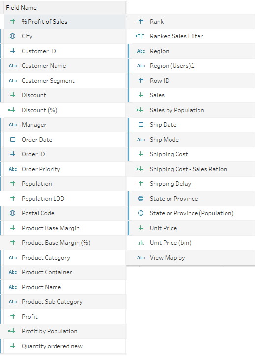

A screenshot of a cell phone Description generated with very high confidence

Figure 1 – Dataset

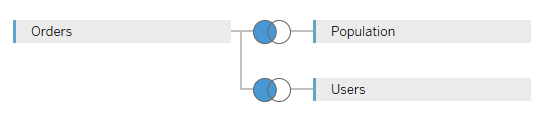

A picture containing screenshot Description generated with high confidence

Figure 2- Left outer join of Order, Population and Users

Appendix B
----------

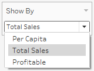

A screenshot of a cell phone Description generated with very high confidence

Figure 3 - Worksheet selector for geographical area

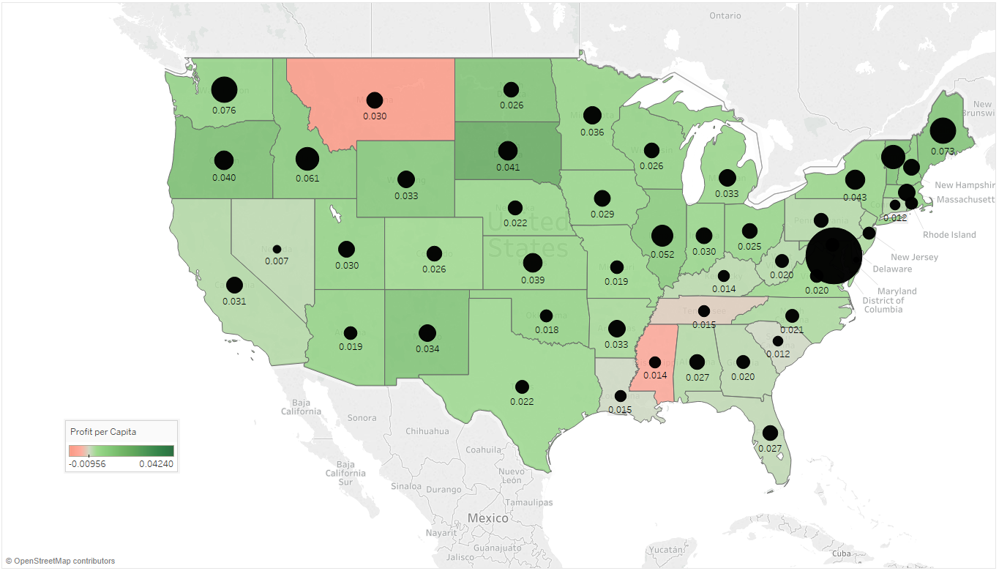

A close up of a map Description generated with high confidence

Figure 4 - Profit per Capita

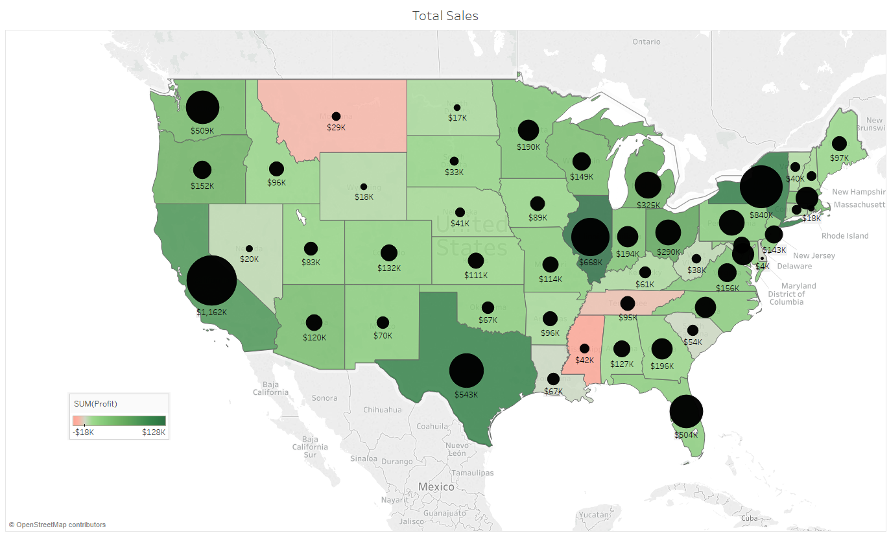

A close up of a map Description generated with high confidence

Figure 5 - Sales vs. Profits

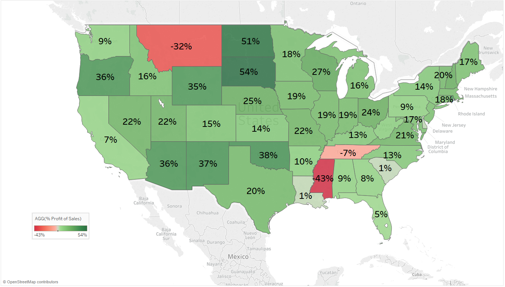

A close up of a map Description generated with very high confidence

Figure 6 - Percentage Profitability

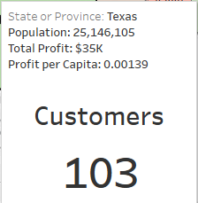

A close up of a sign Description generated with very high confidence

Figure 7 - Tooltip (Number of Customers)

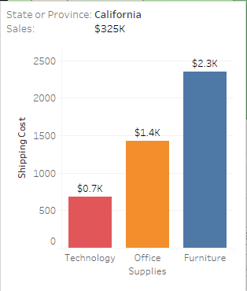

A screenshot of a cell phone Description generated with high confidence

Figure 8 - Shipping Costs – Broken down per product category

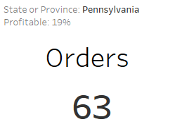

A screenshot of a cell phone Description generated with high confidence

Figure 9 - Number of Orders

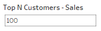

A screenshot of a cell phone Description generated with high confidence

Figure 10 - Select Top N Customers

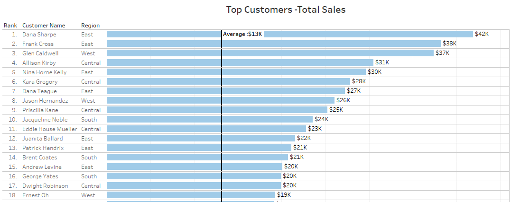

A screenshot of a cell phone Description generated with high confidence

Figure 11 - Top N Customers

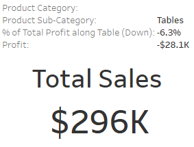

A screenshot of a cell phone Description generated with very high confidence

Figure 12 - Total Sales per Product Sub-Category

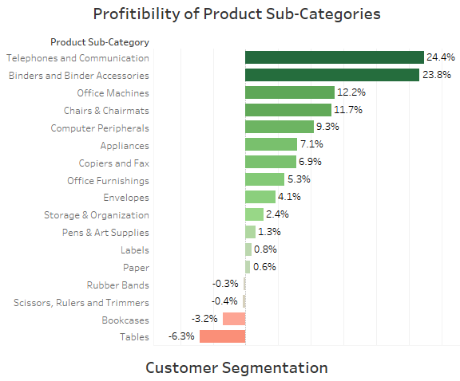

A screenshot of a cell phone Description generated with very high confidence

Figure 13 - Percentage profitability per Product Sub-Category

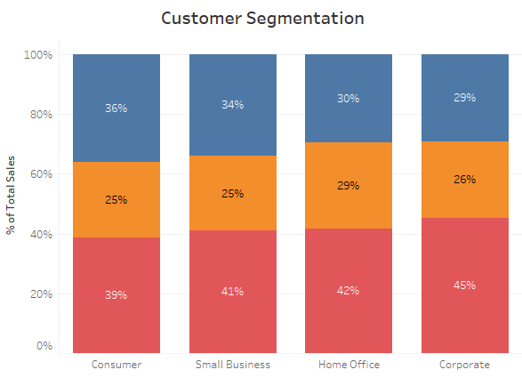

A screenshot of a cell phone Description generated with very high confidence

Figure 14 - Sales volume over Customer Segments

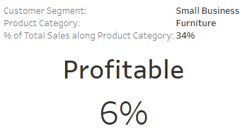

A screenshot of a cell phone Description generated with very high confidence

Figure 15 - Percentage Profitability for selected Customer Segment/Product Group

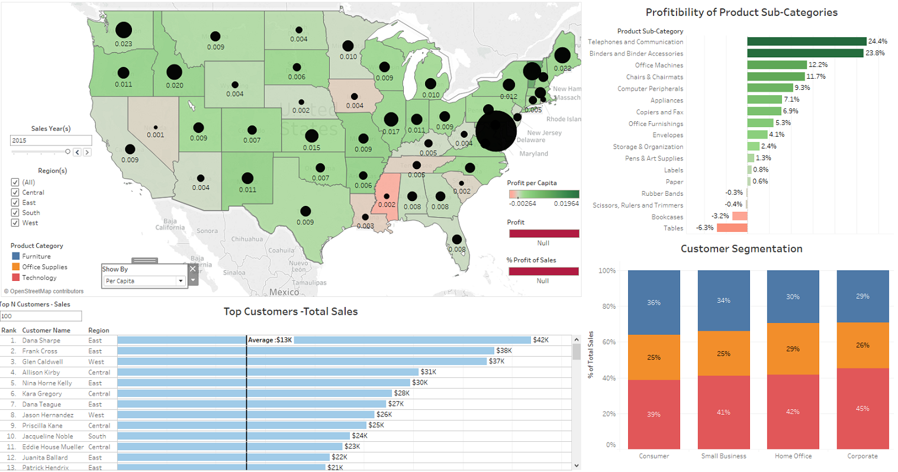

A close up of a map Description generated with very high confidence

Figure 16 – Dashboard

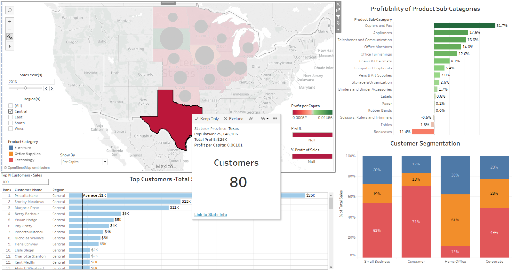

A screenshot of a map Description generated with very high confidence

Figure 17 - Dashboard - Filter I

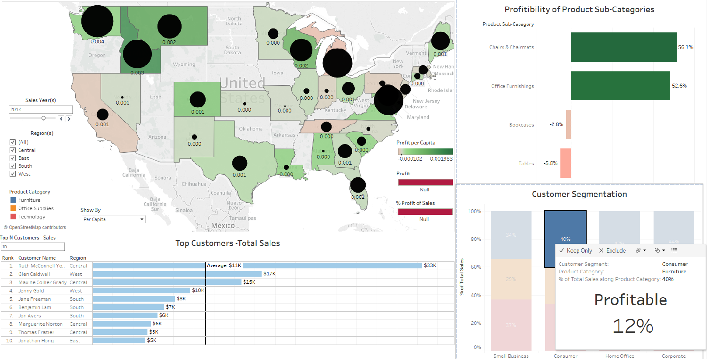

A screenshot of a map Description generated with very high confidence

Figure 18 - Dashboard - Filter II


